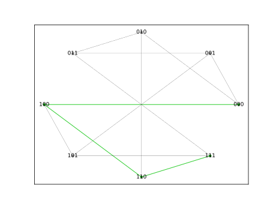
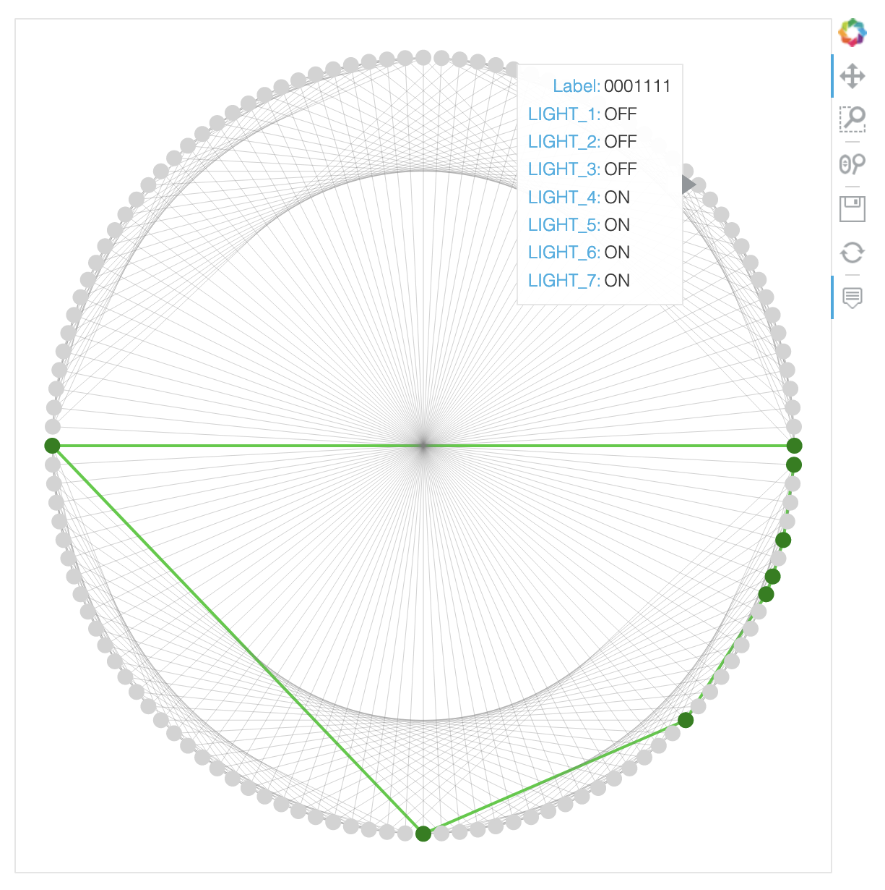

# AutoStates

Imagine that you have several devices. Each device can be described by a finite
state machine. Now, you want that all the devices execute the proper
transition, at the proper time, to achieve a desired goal. The algorithms that
try solve this problem are called planning algorithms and represent one of the
most active research areas in artificial intelligence. AutoStates aims to be a
planning algorithm by making use of [NetworkX](https://networkx.github.io/).

In this very first example ([lights.py](./lights.py)), a user specified number
of lights have to be switched on consecutively. The result will be different at
each execution, since there are many ways to switch three lights on. However,
the program will always execute the required actions to achieve the desired
goal. If the number of lights is smaller than 10, a plot with all the possible
actions for each possible combination of light states will be shown, together
with the chosen solution:

In case that the number of lights is larger than 5, a
[Bokeh](https://docs.bokeh.org/en/latest/index.html) plot is used to allow the
possibility to hover over all the possible light states:

You can try to change the number of lights, but I would recommend not to make
it larger than 15. With 15 lights, you will have almost half a milion possible
actions.  It will take some time to choose one of the possible ways to switch
on all lights.
