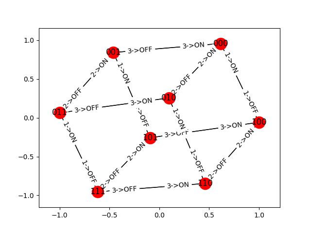

# AutoStates

Imagine that you have several devices. Each device can be described by a finite
state machine. Now, you want that all the devices execute the proper
transition, at the proper time, to achieve a desired goal. This is what
AutoStates aims to solve, making use of
[NetworkX](https://networkx.github.io/).

In this very first example ([lights.py](./lights.py)), three lights have to be
switched on consecutively. The result will be different at each execution,
since there are many ways to switch three lights on. However, the program will
always execute the required actions to achieve the desired goal and plot all
the possible actions for each possible combination of light states:

You can try to change the number of lights, but I would recommend not to make
it larger than 15, or it will take forever to finish.
