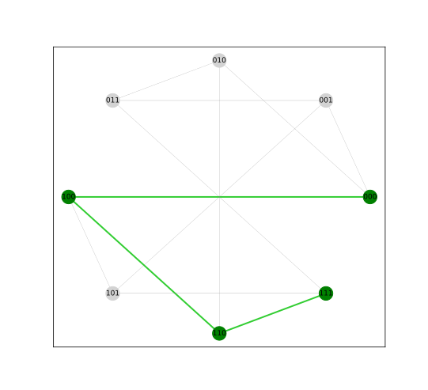
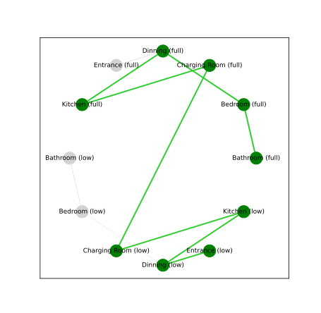

# AutoStates

Imagine that you have several devices. Each device can be described by a finite
state machine. Now, you want that all the devices execute the proper
transition, at the proper time, to achieve a desired goal. The algorithms that
try solve this problem are called planning algorithms and represent one of the
most active research areas in artificial intelligence. AutoStates aims to be a
planning algorithm by making use of
[NetworkX](https://networkx.org/documentation/stable/index.html). It has been
designed to be extremelly simple: 

1. Define the actions as an `Action` subclass.
2. Create a `Domain` instance with a list of all actions.
3. `solve` the domain from a state to a goal.

Some examples are shown bellow to illustrate the possible applications of the
algorithm implemented here:

* [Lights](lights.md). Example showing how to find a way to switch multiple
lights on.
* [Leia](leia.md). Example used in
[PlanSys 2](https://intelligentroboticslab.gsyc.urjc.es/ros2_planning_system.github.io/tutorials/docs/terminal_usage.html)
to move the LEIA robot from one room o another.

## Screenshots

The examples shown above produce the following output:

### Lights

### Leia

