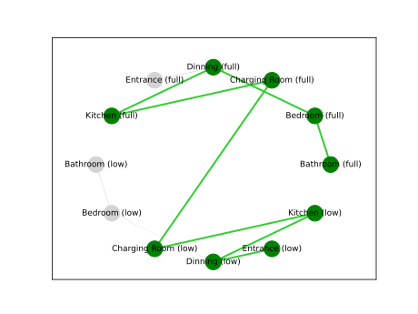
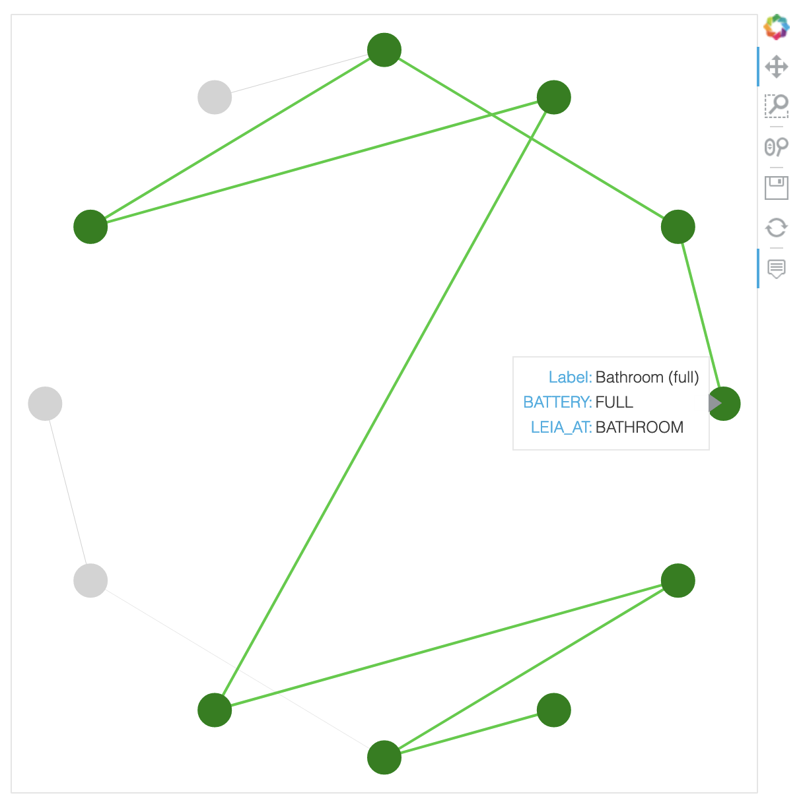

# LEIA

In the [PlanSys 2
Tutorial](https://intelligentroboticslab.gsyc.urjc.es/ros2_planning_system.github.io/tutorials/docs/terminal_usage.html)
pages there is a simple example on how to use Plansys 2 from the terminal. In
the example, a discharged robot named LEIA has to be moved from the entrance of
the bathroom, but first it has to be recharged. 

The LEIA example is implemented in [leya.py](./leia.py). It can be executed by
typing:

```sh
python3 leia.py [matplotlib|bokeh]
```

In this example, the plotting method can be chosen. However, the result will
always be:

```
Example on how to move a discharged LEIA from entrance to bathroom:

Step 1: Moving LEIA from entrance to dinning
Step 2: Moving LEIA from dinning to kitchen
Step 3: Moving LEIA from kitchen to charging room
Step 4: Charging LEIA
Step 5: Moving LEIA from charging room to kitchen
Step 6: Moving LEIA from kitchen to dinning
Step 7: Moving LEIA from dinning to bedroom
Step 8: Moving LEIA from bedroom to bathroom

Bye
```

If `matplotlib` is chosen, the following
[Matplotlib](https://matplotlib.org/stable/index.html) plot will be produced:

<p align="center"><span title="Diagram showing all possible LEIA states and
actions (LEIA domain) and the chosen path to achieve the desired goal"><a href="./leia.svg"></a></span></p>

If `bokeh` is chosen, the following
[Bokeh](https://docs.bokeh.org/en/latest/index.html) plot will be produced:

<p align="center"><span title="Diagram showing all possible LEIA states and
actions (LEIA domain) and the chosen path to achieve the desired goal"><a href="./leia_bokeh.png"></a></span></p>
